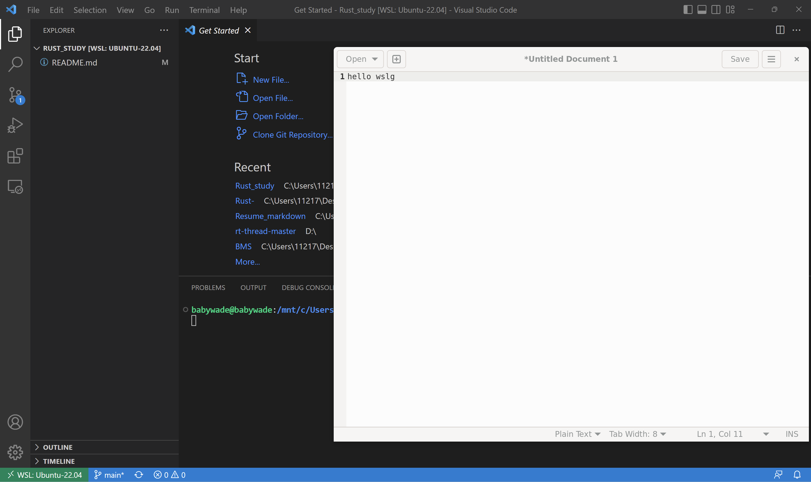
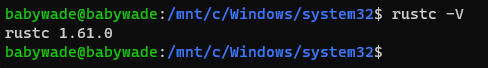
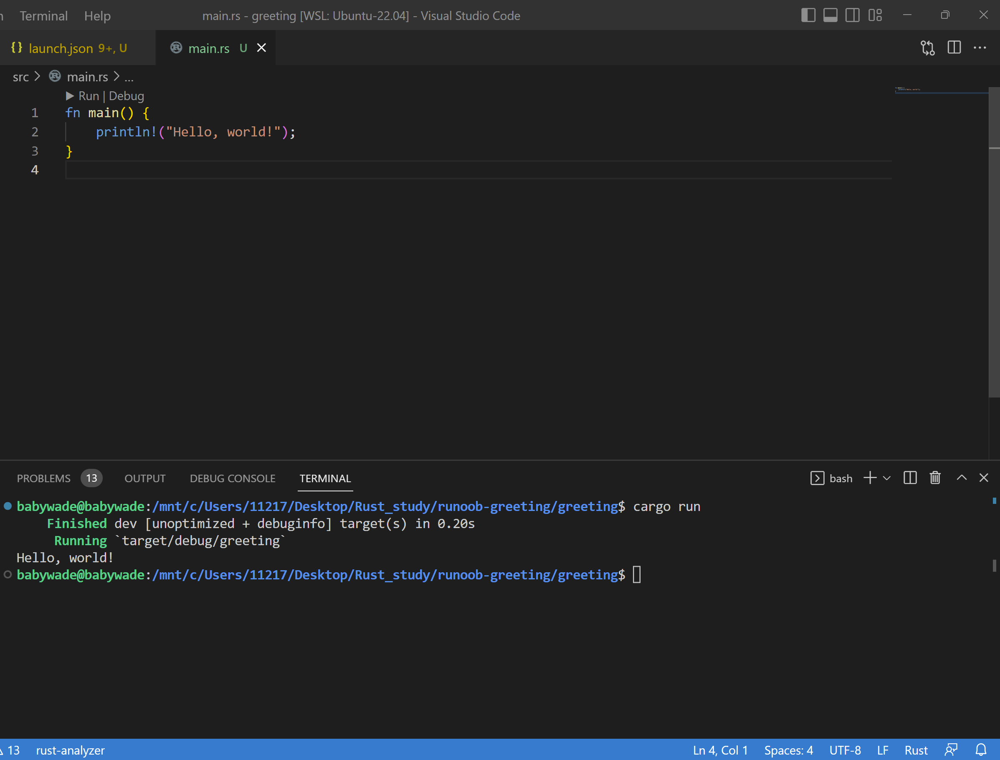

# Rust_study

Rust学习从入门到放弃

前情摘要：wslg 测试 gedit 的 UI

学习环境：windows11下的WSL2，已经测试过wslg。

教程来源于菜鸟教程：https://www.runoob.com/rust/rust-setup.html

wsl2下安装rust开发环境：

1、curl --proto '=https' --tlsv1.2 -sSf https://sh.rustup.rs | sh

2、输入1，回车。

3、不知为何本人本机还要输入sudo apt install rustc 才能测试安装成功 ？

rust hello world

这里 Cargo 是 Rust 的构建系统和包管理器。

Rust 开发者常用 Cargo 来管理 Rust 工程和获取工程所依赖的库。在上个教程中我们曾使用 cargo new greeting 命令创建了一个名为 greeting 的工程，Cargo 新建了一个名为 greeting 的文件夹并在里面部署了一个 Rust 工程最典型的文件结构。这个 greeting 文件夹就是工程本身。
